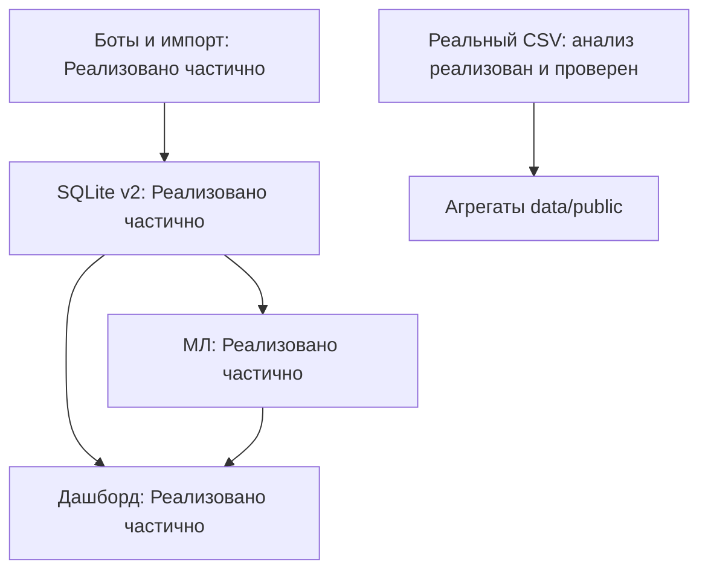

# Поступашки: измерение маркетинга и прогнозирование

Единый локальный проект: сбор событий и импорт оплат → SQLite → семь операционных вкладок дашборда и отдельный раздел МЛ. Боты собирают факты, дашборд объясняет уже случившееся, МЛ оценивает будущие покупки и допустимую цену рекламы. У модулей отдельные инструкции: [боты](bots/README.md), [МЛ](ml/README.md), [аналитика](analysis/README.md).

Поступашки продают курсы через Telegram и менеджеров. В исходном файле видны покупки, но почти не виден путь к ним. Бизнес-вопрос: какие активности приносят дополнительные деньги и как распределить следующие **300 000 ₽**. Продукт постепенно делает этот путь измеримым. Исторический ROMI по имеющимся данным восстановить нельзя.

## Статус компонентов

Статус относится к указанному сценарию целиком. Успешный тест на синтетике не означает внедрение в бизнес.

| Компонент | Статус | Сделано | Что нужно для завершения |
|---|---|---|---|
| Анализ исходных продаж | **Реализовано и проверено** | Повторно рассчитаны аудит, заказы, пакеты, дни, недели и продукты на реальном CSV | Подтверждение бизнесом смысла сумм и группировки заказов |
| Исторический прогноз | **Реализовано и проверено** | 6 методов, временной подбор, проверка последней недели реальных продаж | Более длинная история для оценки стабильности качества |
| Маркетинговая история | **Реализовано частично** | Реальный HTML-экспорт: 1 220 сообщений, 73 в выбранном окне | Текст 18 медийных сообщений недоступен, есть пропущенные публикации; неизвестны внешние размещения и расходы |
| БД, импорт, атрибуция, дашборд | **Реализовано частично** | Локальный запуск, атомарный импорт, clean/mixed, 7 вкладок, проверены HTTP и логика интерфейса | Реальный поток событий, стоимости и подтверждение полноты сбора |
| Боты и приём оплат | **Реализовано частично** | Telegram updates, заявки, подписки, JSON-импорт оплат, очередь, повторная доставка | Боевой токен, права каналов, источник CRM; живые ответы Telegram не проверены |
| МЛ клиентов и каналов | **Реализовано частично** | Обучены 3 задачи, перебор моделей, пакетный прогноз, сценарии, общий дашборд | Реальная история, непокупатели, планы до воздействия, созревшие исходы и проверка качества |
| Эксперименты и выпуск бюджета | **Только спроектировано** | Протокол и лимиты; калькулятор испытан на синтетике | Провести эксперимент с контролем. Автоматического распределения денег нет |

## Запуск

Из корня проекта. Проверен Python **3.12**; ядро рассчитано на Python 3.11+. БД, боты, дашборд и основная аналитика используют стандартную библиотеку Python. `requirements.txt` не содержит сторонних пакетов.

### Дашборд

```bash
python app.py --db data/demo.sqlite3
```

Откройте `http://127.0.0.1:8501`. Общая БД **синтетическая**. Без МЛ-зависимостей операционные вкладки работают, а раздел МЛ объясняет, что установить. Дополнительный синтетический пример мероприятий и когорт:

```bash
python app.py --db data/platform_demo.sqlite3 --port 8502
```

### МЛ в том же приложении

```bash
python -m venv .venv
```

Активация: Linux/macOS `source .venv/bin/activate`; Windows PowerShell `.venv\Scripts\Activate.ps1`.

```bash
python -m pip install -r ml/requirements.txt
python app.py --db data/demo.sqlite3 --models ml/models
```

Новая общая синтетическая БД и переобучение:

```bash
python build_demo.py --db work/demo.sqlite3 --seed 42 --users-per-wave 60
python -m postupashki_ml train --db work/demo.sqlite3 --out work/models --cutoff 2026-09-01 --max-trials 8 --jobs 2
python app.py --db work/demo.sqlite3 --models work/models
```

Генератор отказывается перезаписывать БД. Модель и дашборд используют выбранный `--db`; обучение выполняется отдельно через CLI. `joblib` загружайте только из доверенного источника. При несовпадении версии scikit-learn переобучите модель. Приложение не отправляет прогнозы пользователям и не расходует бюджет.

### Анализ реального исходника

Положите CSV организаторов в `data/private/base.csv`. Исходник не включён в публичную сдачу: агрегаты доступны в `data/public`, идентификаторы покупателей остаются локально.

```bash
python -m analysis.reproduce --input data/private/base.csv --out work/real_analysis
```

Команда воспроизводит анализ реальных продаж без подстановки синтетики. Канонические цифры — `data/public/metrics.json`. Все дополнительные команды исследовательских скриптов — в [analysis/README.md](analysis/README.md).

### Рабочая БД

```bash
python bot.py --db work/live.sqlite3 init
python app.py --db work/live.sqlite3
```

Полный порядок настройки `.env`, справочников, каналов, импорта и всех CLI-подкоманд — в [bots/README.md](bots/README.md). Живое взаимодействие требует прав и токена и не выполнялось при проверке сдачи. Примеры справочников и оплат — шаблоны, а не реальные записи бизнеса.

Для нового синтетического примера сбора без МЛ и агрегатных baseline:

```bash
python bot.py --db work/collector_demo.sqlite3 demo
python bot.py --db work/collector_demo.sqlite3 forecast --as-of 2026-09-01T12:00:00Z --horizon 7
python -m bots.smoke
```

`demo` создаёт отдельный пример мероприятий, не обучает МЛ. Визуальный прогон в полноценном браузере не выполнен: движок браузера недоступен. Проверены HTTP и исполнение JavaScript всех вкладок.

### Проверки

```bash
python -m unittest discover -s tests -q
python tests/check_http.py
python -m unittest discover -s analysis/tests -q
python -m unittest discover -s ml/tests -q
```

Для МЛ нужны `ml/requirements.txt`; для калькулятора эксперимента — `analysis/requirements.txt`. Команды, среда и результаты: [docs/VERIFICATION.md](docs/VERIFICATION.md). Ядро проверено в новом venv без сторонних пакетов. МЛ проверено с зафиксированными установленными версиями; сетевая установка всех пакетов с нуля здесь не заявляется.

## Архитектура



`postupashki_data/` — единая схема фактов и признаков. `store.py` добавляет заявки, техническую очередь и таблицы дашборда. `postupashki_ml/` — отдельные назначения, контакты и модели. `ml_bridge.py` передаёт агрегированные прогнозы в тот же HTTP-сервер без копирования продаж в другую БД. Старый движок в `analysis/attribution/engine` оставлен только для воспроизводимости исследования.

Старые `users.user_key/dataset_id` и новые `users.user_id` несовместимы; старая БД отклоняется. Хеш username в историческом CSV нельзя автоматически связать с Telegram ID новых событий. Нужна таблица соответствий владельца. До её получения историческая аналитика и событийная БД остаются отдельными наборами данных.

## Assumptions: единые определения

1. **Строка исходника** — приобретение курса, не обязательно платёж. **Предполагаемый заказ** — одинаковые покупатель и время до секунды. **Пакет** — заказ с двумя и более разными курсами. Суммы строк складываются: по принятому решению это фактические цены после скидок, включая распределённые доли пакета. Группировка не подтверждена банковскими ID.
2. **Повторный покупатель** имеет минимум два заказа на разных временных отметках в доступном периоде. Одновременный пакет не является повтором. Первая наблюдаемая покупка не доказывает нового клиента бизнеса. Малые суммы и повторные покупки одного курса сохраняются.
3. Дни 04.08–10.09.2026 считаются полными по ранее принятому допущению. Часовой пояс исходника не указан. Срез — 11.09.2026 00:00 в локальном времени источника. Новые события требуют явной зоны и нормализуются в UTC.
4. **Сумма продаж по выгрузке** — сумма `amount`; это не доказанная чистая выручка или прибыль. Возвратов, комиссий, себестоимости и статусов нет. В новой БД заказ и его позиции отделены от оплат и возвратов. Части платежа суммируются, пакет не размножает оплату. Идентичный повтор ID не создаёт дубль; изменённый повтор отклоняется.
5. **Clean** — наблюдаемые идентифицированные касания. **Mixed** добавляет самоотчёт и ограниченное совпадение условий акции. Дата/цена не доказывают просмотр или эффект. Неизвестный источник остаётся неизвестным. Mixed − clean — перераспределение выручки по правилу, не упущенная прибыль.
6. Рабочая атрибуция `last_touch`/`first_touch`/`linear` использует касания до **создания заказа**, окно по умолчанию 90 дней. Оплаты и возвраты наследуют распределение заказа. Это явное изменение прежнего стартового правила (7 суток до оплаты): окно 90 дней выбрано для демонстрации отложенных покупок и не признано оптимальным. Историческое исследование отдельно сравнивает пять правил и окна 1/3/7/14/21 день с привязкой к оплате; результаты двух режимов не смешиваются.
7. **ROMI_attr = (R_attr − C) / C**. R — приписанные поступления минус возвраты; C — реклама и явно зарегистрированные дополнительные денежные расходы. Неизвестное не считается доказанным нулём; при неизвестном/нулевом знаменателе ROMI отсутствует. Скидка уже снизила фактическую цену и **не вычитается второй раз**. Она отображается отдельно; этим исправлена формула первоначальной спецификации.
8. **ROMI_inc_est = (k × R_clean − C) / C**. k — сценарная доля дополнительных продаж или параметр применимого эксперимента. Атрибуция не определяет k. Импорт строки с пометкой `experiment` не подтверждает качество дизайна.
9. МЛ клиента оценивает вероятность полной оплаты выбранного курса за следующие 14 дней. Поздний возврат не стирает факт покупки; экономика учитывает ожидаемые возвраты отдельно. Уже оплаченный и не полностью возвращённый курс исключается из аудитории. Ожидаемые покупатели — сумма вероятностей по допустимой аудитории. Это не число всех заказов и не измеренный causal uplift. Будущие клики не используются как известные признаки.
10. МЛ размещения оценивает новых наблюдаемых пользователей за 7 дней и покупателей среди них за следующие 14 дней: цель созревает за 21 день. **Потолок цены = max(0, ожидаемые покупатели × вклад с покупки × k / (1 + целевая доходность) − прочие расходы)**. Это допустимая цена при допущениях, не рыночная котировка. При неизвестной экономике или k рекомендация может отсутствовать. Парные пересечения каналов приближённые; тройные пересечения и оптимальный бюджет не установлены.
11. Полнота сбора подтверждается отдельно. Отсутствие событий без такого подтверждения не означает ноль. Индивидуальный просмотр поста из публичного счётчика не восстанавливается. Учитываются время события и время его регистрации; несозревшие цели исключаются из обучения.
12. Обе демобазы, модели `ml/models` и проверки МЛ — **синтетические**. Реальные агрегаты — `data/public`. Метрики синтетики показывают работоспособность конвейера, а не коммерческую эффективность.

## Три уровня знания

| Уровень | Результат |
|---|---|
| **Что мы знаем** | 795 строк, 606 покупателей, 18 продуктов, 38 дней; сумма строк **5 904 671,67 ₽**. Пропусков и полных дублей в четырёх полях не найдено |
| **Что мы оцениваем** | 628 предполагаемых заказов, 153 пакета, 20 повторных покупателей (3,30%). Пять крупнейших дней дают 35,13% суммы продаж. Прогноз на 11–17 сентября от среза исходника: 1 102 255 ₽ |
| **Что пока узнать нельзя** | Источник всей суммы 5 904 671,67 ₽, истинный ROMI, причинный вклад акций, конверсию всех подписчиков и LTV. Нужны касания, полная аудитория, связь user→lead→order→payment, расходы, возвраты и контроль |

На последней неделе 04–10 сентября ошибка недельной суммы выбранной модели — **38,15%**, у среднего за 7 дней — **26,96%**. Подбор использовал 11 перекрывающихся окон (17 уникальных целевых дат). Последняя неделя исключена из выбора модели, но предшествующий EDA видел весь файл: это не новый закрытый внешний тест. Диапазон 281 499–1 923 010 ₽ для следующей недели эмпирический, без гарантированного покрытия. Сложность не дала доказанного преимущества.

Реальный экспорт подтверждает публикации, но не прочтение покупателями. Совпадение условий акции найдено у 52 предполагаемых заказов на 372 480 ₽; эта сумма не объявляется причинённой акцией.

## Описание base.xlsx

Доступен CSV листа «Данные», а не исходная книга со всеми листами и метаданными.

| Поле CSV | Поле условия | Значение и ограничение |
|---|---|---|
| `Номер студента` | `student_id` | Обезличенный ID из username; не Telegram numeric ID |
| `Сумма` | `amount` | Рубли с десятичной запятой; вычисления через целые копейки |
| `Курс` | `course` | Приобретённый курс; 18 разных значений |
| `Время` | `timestamp` | `ДД.ММ.ГГГГ ЧЧ:ММ:СС`, покупка/выдача доступа по условию; зона не указана |

Нет order_id, payment_id, статусов, возвратов, затрат, источников, касаний и непокупателей. CSV сам по себе не позволяет обучить клиентскую вероятность покупки или доходность конкретного канала. Схема событий: [docs/schema_reference.md](docs/schema_reference.md), признаки: [docs/features.md](docs/features.md).

## Гипотезы и следующий бюджет

- Сезон стажировок повышает спрос: несколько сезонов истории, календарь наборов, цены и активности.
- Покупатели подписаны до оплаты: времена вступления/выхода, связь с payment, сравнение с непокупателями.
- Прогрев затухает, слишком частые сообщения снижают отклик: заранее назначенные варианты частоты, контроль, горизонты 7/14/30 дней.
- Скидка добавляет маржинальный доход: назначенные группы, себестоимость, возвраты, перенос покупки во времени.
- Повторная реклама исчерпывает канал: сопоставимые размещения, доля новых людей, пересечения и затраты.
- Мероприятия дают отложенные покупки: участие/завершение, контроль, созревшие горизонты 30/60/90 дней.

Это планы проверки, а не установленные результаты. Предложенные лимиты: **60 000 ₽** — измерительный пилот, **90 000 ₽** — подтверждение, **150 000 ₽** — последующие транши. Это не цены каналов и не результат оптимизации. Без пригодного контроля и положительного дополнительного вклада **240 000 ₽ остаются резервом**. Тест сообщения своей аудитории не доказывает окупаемость внешнего размещения.

## Почему выбраны методы

Deep-link/invite-link связывают наблюдаемое действие с размещением. `chat_member` требует административных прав и не восстанавливает прошлую историю ([Telegram Bot API](https://core.telegram.org/bots/api#chatmemberupdated)). Для прогрева сравниваются формы памяти и насыщения: adstock и Hill используются в [Meta Robyn](https://facebookexperimental.github.io/Robyn/docs/features/) для отложенного отклика и убывающей отдачи. Здесь это собственные событийные признаки, их полезность на реальных данных ещё предстоит проверить. Полноценный MMM или доказанный causal uplift не заявляются.

## Состав сдачи

`deliverables/` — двухстраничный PDF и презентация до 10 слайдов. [Инвентаризация](docs/INVENTORY.md) перечисляет источники и статусы; [проверки](docs/VERIFICATION.md) фиксируют команды и результаты. `.env`, исходные CSV/HTML, реальные БД и индивидуальные результаты не включены. Скриншоты используют вымышленные данные.

**GitHub пока не опубликован и не проверен:** подключение аккаунта команды не предоставлено. Комплект готов для одного репозитория, фиктивной ссылки нет. После публикации URL необходимо открыть без авторизации.
